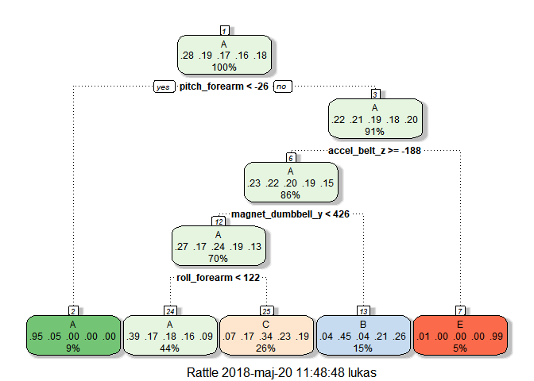

##1. Introduction

Analysis below is perform to produce Practical Machine Learing Coursera Project. Please see below for exercise description:

*Using devices such as Jawbone Up, Nike FuelBand, and Fitbit it is now possible to collect a large amount of data about personal activity relatively inexpensively. These type of devices are part of the quantified self movement – a group of enthusiasts who take measurements about themselves regularly to improve their health, to find patterns in their behavior, or because they are tech geeks. One thing that people regularly do is quantify how much of a particular activity they do, but they rarely quantify how well they do it. In this project, your goal will be to use data from accelerometers on the belt, forearm, arm, and dumbell of 6 participants. They were asked to perform barbell lifts correctly and incorrectly in 5 different ways.*

##2. Reading and cleaning data

On the beginning, there is a need to download and read data sets.


```r
download.file("https://d396qusza40orc.cloudfront.net/predmachlearn/pml-training.csv",destfile="pml-training.csv")
download.file("https://d396qusza40orc.cloudfront.net/predmachlearn/pml-testing.csv", destfile="pml-testing.csv")

trainSet<-read.csv("pml-training.csv",na.strings=c("NA","#DIV/0!",""))
testSet<-read.csv("pml-testing.csv",na.strings=c("NA","#DIV/0!",""))
dim(trainSet)
```

```
## [1] 19622   160
```


```r
dim(testSet)
```

```
## [1]  20 160
```

To futher analysis we will use *caret* and *rattle* packages.


```r
library(caret)
library(rattle)
```
Since we have 160 variables, there is a need to reduct this number. First of all, we delete variables, which are NA's.


```r
isNA<-colSums(is.na(trainSet))==0
trainSet<-trainSet[,isNA]
```
Number of variables is reducted now to 60. This is still too much variables. We will delate variable which are still near zero, cause they don't bring any information. Also first five variables are gives information about record and brings no valuable information.


```r
trainSet<-trainSet[,-nearZeroVar(trainSet)]
trainSet<-trainSet[,-(1:7)]
```

Now we has finally number of variables used to analysis - 52. 

##3. Model selection

We would like to predict variable **classe**. We divide test set into appropriate test set and validation test. Test set will contain circum 70% of data and validation test remaining 30%.


```r
set.seed(2508)
testInd<-createDataPartition(trainSet$classe, p=0.7,list=F)
valSet<-trainSet[-testInd,]
trainSet<-trainSet[testInd,]
dim(valSet)
```

```
## [1] 5885   52
```

```r
dim(trainSet)
```

```
## [1] 13737    52
```

```r
summary(trainSet$classe)
```

```
##    A    B    C    D    E 
## 3906 2658 2396 2252 2525
```

We check three different methods: decision tree, random forest and generilized boosting model.

###A. Decision tree

First method used to build model is decision tree. It is trained wtih using *caret* package like below.


```r
set.seed(2508)
model1<-train(classe~., method="rpart", data=trainSet)
model1$finalModel
```

```
## n= 13737 
## 
## node), split, n, loss, yval, (yprob)
##       * denotes terminal node
## 
##  1) root 13737 9831 A (0.28 0.19 0.17 0.16 0.18)  
##    2) pitch_forearm< -26.45 1227   60 A (0.95 0.049 0 0 0) *
##    3) pitch_forearm>=-26.45 12510 9771 A (0.22 0.21 0.19 0.18 0.2)  
##      6) accel_belt_z>=-187.5 11771 9038 A (0.23 0.22 0.2 0.19 0.15)  
##       12) magnet_dumbbell_y< 426.5 9682 7031 A (0.27 0.17 0.24 0.19 0.13)  
##         24) roll_forearm< 121.5 6069 3678 A (0.39 0.17 0.18 0.16 0.092) *
##         25) roll_forearm>=121.5 3613 2395 C (0.072 0.17 0.34 0.23 0.19) *
##       13) magnet_dumbbell_y>=426.5 2089 1152 B (0.039 0.45 0.043 0.21 0.26) *
##      7) accel_belt_z< -187.5 739    6 E (0.0081 0 0 0 0.99) *
```

```r
fancyRpartPlot(model1$finalModel)
```

<!-- -->

Now, let's see how good this model predicts real values. We look at training set to see in sample error and validation set to see out of sample error.


```r
trainFit1<-predict(model1,newdata=trainSet)
confusionMatrix(trainSet$classe,trainFit1)
```

```
## Confusion Matrix and Statistics
## 
##           Reference
## Prediction    A    B    C    D    E
##          A 3558   82  260    0    6
##          B 1103  937  618    0    0
##          C 1089   89 1218    0    0
##          D  987  439  826    0    0
##          E  559  542  691    0  733
## 
## Overall Statistics
##                                           
##                Accuracy : 0.4692          
##                  95% CI : (0.4609, 0.4776)
##     No Information Rate : 0.5311          
##     P-Value [Acc > NIR] : 1               
##                                           
##                   Kappa : 0.3051          
##  Mcnemar's Test P-Value : NA              
## 
## Statistics by Class:
## 
##                      Class: A Class: B Class: C Class: D Class: E
## Sensitivity            0.4877  0.44854  0.33712       NA  0.99188
## Specificity            0.9460  0.85225  0.88364   0.8361  0.86213
## Pos Pred Value         0.9109  0.35252  0.50835       NA  0.29030
## Neg Pred Value         0.6198  0.89602  0.78882       NA  0.99946
## Prevalence             0.5311  0.15207  0.26301   0.0000  0.05380
## Detection Rate         0.2590  0.06821  0.08867   0.0000  0.05336
## Detection Prevalence   0.2843  0.19349  0.17442   0.1639  0.18381
## Balanced Accuracy      0.7168  0.65039  0.61038       NA  0.92701
```

```r
valFit1<-predict(model1,newdata=valSet)
confusionMatrix(valSet$classe,valFit1)
```

```
## Confusion Matrix and Statistics
## 
##           Reference
## Prediction    A    B    C    D    E
##          A 1512   34  128    0    0
##          B  474  385  279    0    1
##          C  477   40  509    0    0
##          D  414  177  373    0    0
##          E  252  230  305    0  295
## 
## Overall Statistics
##                                           
##                Accuracy : 0.459           
##                  95% CI : (0.4462, 0.4718)
##     No Information Rate : 0.5317          
##     P-Value [Acc > NIR] : 1               
##                                           
##                   Kappa : 0.2917          
##  Mcnemar's Test P-Value : NA              
## 
## Statistics by Class:
## 
##                      Class: A Class: B Class: C Class: D Class: E
## Sensitivity            0.4832  0.44457  0.31932       NA  0.99662
## Specificity            0.9412  0.84977  0.87952   0.8362  0.85919
## Pos Pred Value         0.9032  0.33802  0.49610       NA  0.27264
## Neg Pred Value         0.6160  0.89865  0.77670       NA  0.99979
## Prevalence             0.5317  0.14715  0.27086   0.0000  0.05030
## Detection Rate         0.2569  0.06542  0.08649   0.0000  0.05013
## Detection Prevalence   0.2845  0.19354  0.17434   0.1638  0.18386
## Balanced Accuracy      0.7122  0.64717  0.59942       NA  0.92790
```

As we can see, this model gives very low accurancy and hence very big in sample error: 0.5307564. Also out of sample error is too big: 0.5410365. There is a need to search better model.

###B. Random forest

For random forest model we use k-fold validation with 5 as number of fold.


```r
set.seed(2508)
crossVal <- trainControl(method="cv", number=5, verboseIter=FALSE)
model2 <- train(classe ~ ., data=trainSet, method="rf",trControl=crossVal)
model2$finalModel
```

```
## 
## Call:
##  randomForest(x = x, y = y, mtry = param$mtry) 
##                Type of random forest: classification
##                      Number of trees: 500
## No. of variables tried at each split: 26
## 
##         OOB estimate of  error rate: 0.71%
## Confusion matrix:
##      A    B    C    D    E class.error
## A 3900    4    1    0    1 0.001536098
## B   28 2624    5    0    1 0.012791573
## C    0   13 2373   10    0 0.009599332
## D    0    1   24 2225    2 0.011989343
## E    0    0    2    5 2518 0.002772277
```

Now, let's how good is prediction for train and validation sets.


```r
trainFit2<-predict(model2,newdata=trainSet)
confusionMatrix(trainSet$classe,trainFit2)
```

```
## Confusion Matrix and Statistics
## 
##           Reference
## Prediction    A    B    C    D    E
##          A 3906    0    0    0    0
##          B    0 2658    0    0    0
##          C    0    0 2396    0    0
##          D    0    0    0 2252    0
##          E    0    0    0    0 2525
## 
## Overall Statistics
##                                      
##                Accuracy : 1          
##                  95% CI : (0.9997, 1)
##     No Information Rate : 0.2843     
##     P-Value [Acc > NIR] : < 2.2e-16  
##                                      
##                   Kappa : 1          
##  Mcnemar's Test P-Value : NA         
## 
## Statistics by Class:
## 
##                      Class: A Class: B Class: C Class: D Class: E
## Sensitivity            1.0000   1.0000   1.0000   1.0000   1.0000
## Specificity            1.0000   1.0000   1.0000   1.0000   1.0000
## Pos Pred Value         1.0000   1.0000   1.0000   1.0000   1.0000
## Neg Pred Value         1.0000   1.0000   1.0000   1.0000   1.0000
## Prevalence             0.2843   0.1935   0.1744   0.1639   0.1838
## Detection Rate         0.2843   0.1935   0.1744   0.1639   0.1838
## Detection Prevalence   0.2843   0.1935   0.1744   0.1639   0.1838
## Balanced Accuracy      1.0000   1.0000   1.0000   1.0000   1.0000
```

```r
valFit2<-predict(model2,newdata=valSet)
confusionMatrix(valSet$classe,valFit2)
```

```
## Confusion Matrix and Statistics
## 
##           Reference
## Prediction    A    B    C    D    E
##          A 1672    1    0    0    1
##          B   14 1121    2    1    1
##          C    0    7 1017    2    0
##          D    0    0    8  955    1
##          E    0    0    3    9 1070
## 
## Overall Statistics
##                                           
##                Accuracy : 0.9915          
##                  95% CI : (0.9888, 0.9937)
##     No Information Rate : 0.2865          
##     P-Value [Acc > NIR] : < 2.2e-16       
##                                           
##                   Kappa : 0.9893          
##  Mcnemar's Test P-Value : NA              
## 
## Statistics by Class:
## 
##                      Class: A Class: B Class: C Class: D Class: E
## Sensitivity            0.9917   0.9929   0.9874   0.9876   0.9972
## Specificity            0.9995   0.9962   0.9981   0.9982   0.9975
## Pos Pred Value         0.9988   0.9842   0.9912   0.9907   0.9889
## Neg Pred Value         0.9967   0.9983   0.9973   0.9976   0.9994
## Prevalence             0.2865   0.1918   0.1750   0.1643   0.1823
## Detection Rate         0.2841   0.1905   0.1728   0.1623   0.1818
## Detection Prevalence   0.2845   0.1935   0.1743   0.1638   0.1839
## Balanced Accuracy      0.9956   0.9946   0.9928   0.9929   0.9974
```

Random forest algoritm perfectly fit classes in train set. In validation set we have out of sample error equal to 0.0084962 - it could gives good prediction for another set of data.

###C. Generalized Boosting Method

Third and the last fitted method is generalized boosting method.


```r
set.seed(2508)
crossVal <- trainControl(method = "cv", number = 5, verboseIter = FALSE)
model3  <- train(classe ~ ., data=trainSet, method = "gbm",trControl = crossVal, verbose = FALSE)
model3$finalModel
```

```
## A gradient boosted model with multinomial loss function.
## 150 iterations were performed.
## There were 51 predictors of which 43 had non-zero influence.
```

Now we can check predctions for both sets.


```r
trainFit3<-predict(model3,newdata=trainSet)
confusionMatrix(trainSet$classe,trainFit3)
```

```
## Confusion Matrix and Statistics
## 
##           Reference
## Prediction    A    B    C    D    E
##          A 3868   23   11    0    4
##          B   64 2534   58    1    1
##          C    0   44 2321   27    4
##          D    1   12   64 2168    7
##          E    1   17   17   25 2465
## 
## Overall Statistics
##                                           
##                Accuracy : 0.9723          
##                  95% CI : (0.9694, 0.9749)
##     No Information Rate : 0.2864          
##     P-Value [Acc > NIR] : < 2.2e-16       
##                                           
##                   Kappa : 0.9649          
##  Mcnemar's Test P-Value : 2.364e-15       
## 
## Statistics by Class:
## 
##                      Class: A Class: B Class: C Class: D Class: E
## Sensitivity            0.9832   0.9635   0.9393   0.9761   0.9936
## Specificity            0.9961   0.9888   0.9933   0.9927   0.9947
## Pos Pred Value         0.9903   0.9533   0.9687   0.9627   0.9762
## Neg Pred Value         0.9933   0.9913   0.9868   0.9954   0.9986
## Prevalence             0.2864   0.1915   0.1799   0.1617   0.1806
## Detection Rate         0.2816   0.1845   0.1690   0.1578   0.1794
## Detection Prevalence   0.2843   0.1935   0.1744   0.1639   0.1838
## Balanced Accuracy      0.9897   0.9762   0.9663   0.9844   0.9941
```

```r
valFit3<-predict(model3,newdata=valSet)
confusionMatrix(valSet$classe,valFit3)
```

```
## Confusion Matrix and Statistics
## 
##           Reference
## Prediction    A    B    C    D    E
##          A 1641   19    9    5    0
##          B   43 1043   44    3    6
##          C    0   26  988   10    2
##          D    0    5   30  924    5
##          E    4   11   15   17 1035
## 
## Overall Statistics
##                                           
##                Accuracy : 0.9568          
##                  95% CI : (0.9513, 0.9619)
##     No Information Rate : 0.2868          
##     P-Value [Acc > NIR] : < 2.2e-16       
##                                           
##                   Kappa : 0.9454          
##  Mcnemar's Test P-Value : 3.076e-09       
## 
## Statistics by Class:
## 
##                      Class: A Class: B Class: C Class: D Class: E
## Sensitivity            0.9722   0.9447   0.9098   0.9635   0.9876
## Specificity            0.9921   0.9799   0.9921   0.9919   0.9903
## Pos Pred Value         0.9803   0.9157   0.9630   0.9585   0.9566
## Neg Pred Value         0.9888   0.9871   0.9798   0.9929   0.9973
## Prevalence             0.2868   0.1876   0.1845   0.1630   0.1781
## Detection Rate         0.2788   0.1772   0.1679   0.1570   0.1759
## Detection Prevalence   0.2845   0.1935   0.1743   0.1638   0.1839
## Balanced Accuracy      0.9821   0.9623   0.9509   0.9777   0.9889
```

In sample error is equal to 0.0277353 and out of sample error is equal 0.0431606.

##4. Summary

Comparing out of sample errors, we can say that the best prediction gives random forest algorithm. And for this algorithm we apply prediction for 20 observation in test set.


```r
predict(model2,newdata=testSet)
```

```
##  [1] B A B A A E D B A A B C B A E E A B B B
## Levels: A B C D E
```
